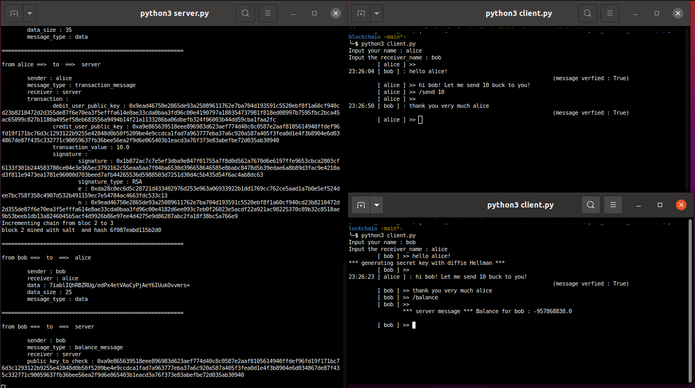

# gs15-blockchain

A centralized encrypted messaging python3 implementation packed with a blockchain service
It implements Kasumi cipher, RSA / El Gamal signature and Diffie Hellman key exchange protocol
 
## Prerequisites
* Bitstring
* Pyfinite
## How to use 
### launch the server 
you should start first the server by executing the script **server.py**
### launch clients
you should lauch clients (**client.py**) two by two. On startup, each client will ask for the client 
name and the receiver name. 
* Please make sure that the receiver name matches another client before sending anything
* The client will generate a large prime number on startup to init the cryptographic algorithms.
This number will be stored on a file, which means that the next startup process will be faster.
### client commands
#### messaging commands
* Any text message that is not a command (described bellow) will be send to the receiver client (after beeing cipherd and signed)
* **exit**: terminates the connection with the server and closes the client script
#### blockchain commands
Those commands should be used only after sending at least one text message to make sure that users send each other their public keys
* **/send <amount: float>**: executes a transaction from client to receiver with value amount
* **/balance**: computes and displays on server-side the client's account balance
* **/verify**: asks the server to verify the blockchain. The server logs the result

